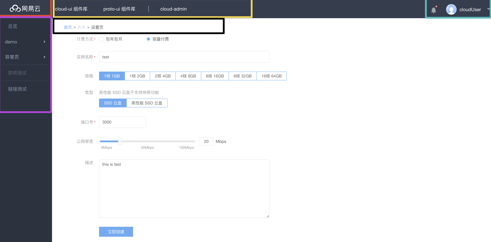

# 布局

页面整体布局是一个产品最外层的框架结构，往往会包含导航、侧边栏、面包屑以及内容等。

## Layout



其中被框住的部分均可以自定义。具体文件可查看 `src/views/dashboard/layout/index.vue`。

## 面包屑

部分情况下，我们需要借助面包屑进行导航。通过在路由的 `meta` 属性设置 `crumb` 可以很方便的完成这个需求。具体文件可查看 `src/views/dashboard/layout/components/u-crumb.vue`

```javascript
meta: {
    crumb: {
        label: '首页',
        to: '/overview',
    },
    // crumb($routes) {
    //     return {
    //         label: '首页',
    //         to: '/overview',
    //     };
    // },
},

```

::: tip
面包屑信息配置，具体可见 [u-crumb](https://vusion.github.io/cloud-ui/components/u-crumb)
:::
