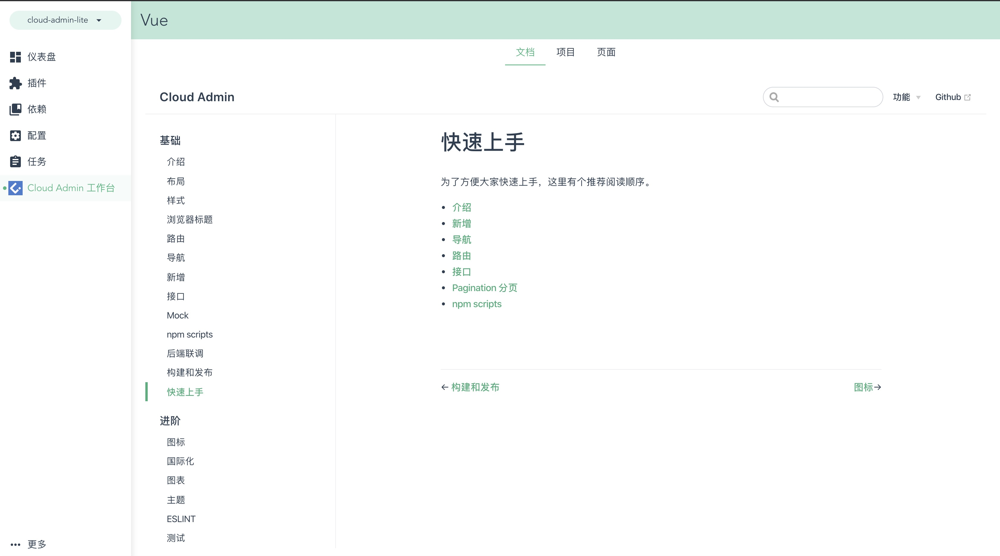

# npm scripts

## dev

开发模式下运行

## build

发布时运行

## lint

### lint 信息

项目配置了 `eslint` 相关规则，在编辑的时候配合编辑器插件会自动检查相关文件的格式问题。同时在 `commit` 中会自动运行相关 `lint`。

```shell
npm run lint
```

### lint:fix

这个脚本会自动修复一些 lint 错误。

```shell
npm run lint:fix
```

## dll

本项目对常用的 `node_modules` 进行了 `dll` 操作。如果更新了某些库，但没有生效，可以运行此命令。

```shell
npm run dll
```

:::tip
请注意保持 `vue` 和 `vue-template-compiler` 版本的一致性，不一致会产生一些意料之外的问题。
:::

## test:unit

会运行 `tests` 目录的测试脚本。

```shell
npm run test:unit
npm run test:unit:watch // dev
```

## plop

用于初始化模块、全局组件。

```shell
npm run manage
```

详情可见[初始化模板](/guide/advanced/template.html)

## ui

支持 `GUI` 模式查看整个项目。默认会显示概览页，请点击导入，选择正确的文件夹，即可看到如下页面。



:::tip

+ 在 `任务页面` 可以运行 `dev` 相关命令
+ 在 `Cloud Admin 工作台` 内置了文档以及相关配置快速入口，方便查看该项目要点

:::
